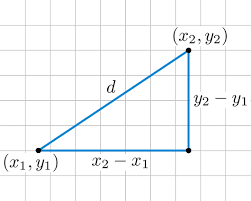
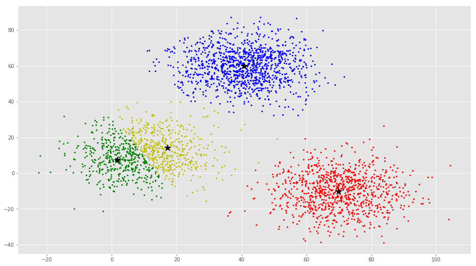
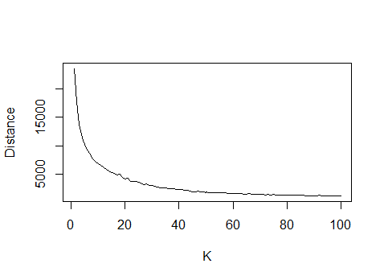
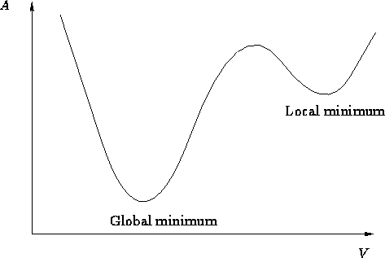
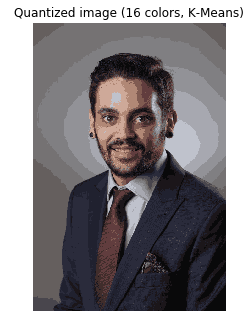
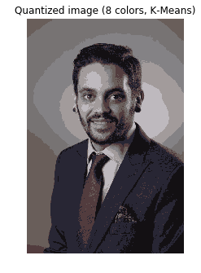
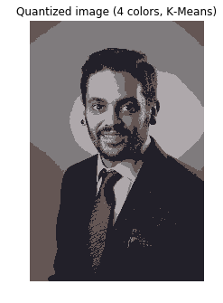
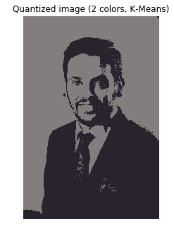

```{r setup, include=FALSE}
knitr::opts_chunk$set(echo = FALSE)
```

##K-Means {.build}

What is k means?

How can we evaluate it?

Why would we use it?

Lets see it in action!

##What is K Means? {.build}

The K-means algorithm is a **quick**, **lightweight**, **unsupervised** machine learning algorithm used to find **internal structures** of data which are not inherantly obvious.

Quick

Lightweight

Unsupervised

##Machine Learning Types {.build}

```{r out.width = "160%", out.height = "200%", fig.align="center", echo=FALSE}


```


##What is K Means?

The K-means algorithm is a **quick**, **lightweight**, **unsupervised** machine learning algorithm used to find **internal structures** of data which are not inherantly obvious.

Quick

Lightweight

Unsupervised

##What is K Means?

The K-means algorithm is a **quick**, **lightweight**, **unsupervised** machine learning algorithm used to find **internal structures** of data which are not inherantly obvious.

Quick

Lightweight

Unsupervised

Internal Structure

##What is K Means?

The K-means algorithm is a **quick**, **lightweight**, **unsupervised** machine learning algorithm used to find **internal structures** of data which are not inherantly obvious.

Quick

Lightweight

Unsupervised

Internal Structure?

## What Is A Cluster? {.build}

Clustering is the grouping of objects according to certain attributes.

```{r out.width = "90%", out.height = "90%", fig.align="center", fig.cap="Before and after clustering", echo=FALSE}
knitr::include_graphics("images/cluster_before_after.png")

```


## Assignment Function{.build}

K means uses the Euclidean distance from the data points to centroids to to assign datapoints to clusters.


$$||\vec{a}|| = \sqrt{a_1^2 + a_2^2 + \dots + a_n^2}$$

```{r out.width = "50%", out.height = "50%", fig.align="center", fig.cap="Euclidean Distance in R2", echo=FALSE}


```

##Summarizing a cluster{.build}

k = number of clusters

k cluster centers (Centroid)

$$\mu_k = (\mu_{k,1},\mu_{k,2},\dots,\mu_{k,d})$$

$$\mu_1,\mu_2,\dots,\mu_k$$

##Cluster Summary

```{r out.width = "90%", out.height = "90%", fig.align="center", fig.cap="k=4 Clustering", echo=FALSE}


```

##Summarizing a cluster

k = number of clusters

k cluster centers (Centroid)

$$\mu_k = (\mu_{k,1},\mu_{k,2},\dots,\mu_{k,d})$$

$$\mu_1,\mu_2,\dots,\mu_k$$

##Summarizing a cluster

k = number of clusters

k cluster centers (Centroid)

$$\mu_k = (\mu_{k,1},\mu_{k,2},\dots,\mu_{k,d})$$

$$\mu_1,\mu_2,\dots,\mu_k$$

Each cluster will have a set of points S assigned to it

##Summarizing a cluster

k = number of clusters

k cluster centers (Centroid)

$$\mu_k = (\mu_{k,1},\mu_{k,2},\dots,\mu_{k,d})$$

$$\mu_1,\mu_2,\dots,\mu_k$$

Each cluster will have a set of points S assigned to it

$$S_k = Set\ of\ points\ in\ cluster\ k$$

##Summarizing a cluster

k = number of clusters

k cluster centers (Centroid)

$$\mu_k = (\mu_{k,1},\mu_{k,2},\dots,\mu_{k,d})$$

$$\mu_1,\mu_2,\dots,\mu_k$$

Each cluster will have a set of points S assigned to it

$$S_k = Set\ of\ points\ in\ cluster\ k$$

$$S_1,S_2,\dots,S_k$$

##Cluster Summary

```{r out.width = "90%", out.height = "90%", fig.align="center", fig.cap="K = 4 Clustering", echo=FALSE}


```


##k means assignment{.build}

\
\
\
\

$$||\vec{a}|| = \sqrt{a_1^2 + a_2^2 + \dots + a_n^2}$$


##k means assignment

\
\
\
\

$$||x_n - \mu_k|| = \sqrt{(x_{n,1}-\mu_{k,1})^2+\dots+(x_{n,d}-\mu_{k,d})^2}$$

##Loss Function{.build .bigger}

$$Distance_{Global} = \sum_{i=1}^k \sum_{n:x_n \in S_k} ||x_{n}-\mu_{k}||^2 \rightarrow min$$

$\sum_{i=1}^k$ = Sum amongst all clusters

$\sum_{n:x_n \in S_k}$ = for each point in the cluster

$||x_{n} - \mu_{k}||^2$ = the squared distance from each $x_n$ to its respective $\mu_k$

##Steps to Cluster {.build}

-Initialize K clusters

-Repeat untill "convergence"{

\ \ \ \ 1. Assign each datapoint to the cluster with the clostset 
\ \ \ \ \ \ centroid

\ \ \ \ 2. Assign each centroid to be the mean of its clusters
\ \ \ \ \ \ datapoints.

}

##Pseudocode

-Initialize K clusters

-Repeat untill "convergence"{

\ \ \ \ 1. Assign each datapoint to the cluster with the clostset 
\ \ \ \ \ \ centroid

\ \ \ \ 2. Assign each centroid to be the mean of its clusters
\ \ \ \ \ \ datapoints.

}

##Pseudocode

Randomly sample k points from dataset without replacement

$$\mu_k\leftarrow x_n$$

- Repeat untill "convergence"{

\ \ \ \ 1. Assign each datapoint to the cluster with the clostset
\ \ \ \ \ \ centroid

\ \ \ \ 2. Assign each centroid to be the mean of its clusters
\ \ \ \ \ \ datapoints.

}

##Pseudocode

Randomly sample k points from dataset without replacement

$$\mu_k\leftarrow x_n$$

Repeat untill $S_1...S_k$ "don't change"{

\ \ \ \ 1. Assign each datapoint to the cluster with the clostset
\ \ \ \ \ \ centroid

\ \ \ \ 2. Assign each centroid to be the mean of its clusters 
\ \ \ \ \ \ datapoints.

}


  
##Pseudocode

Randomly sample k points from dataset without replacement

$$\mu_k\leftarrow x_n$$

Repeat untill $S_1...S_k$ "don't change"{

\ \ \ \ -find $\mu_k$ for $x_n$ with the smallest $||x_n - \mu_k||$
  
\ \ \ \ -Place $x_n$ in Set $S_k$ and no other $S_j$

\ \ \ \ 2.Assign each centroid to be the mean of its clusters
\ \ \ \ \ \ datapoints.

}

##Pseudocode

Randomly sample k points from dataset without replacement

$$\mu_k\leftarrow x_n$$

Repeat untill $S_1...S_k$ "don't change"{

\ \ \ \ -find $\mu_k$ for $x_n$ with the smallest $||x_n - \mu_k||$
  
\ \ \ \ -Place $x_n$ in Set $S_k$ and no other $S_j$

  $$\mu_k\leftarrow \frac{1}{|S_k|}\sum_{n:x_n \in S_k} x_n$$

}

## Evaluation 

```{r,echo = FALSE, warning=FALSE}
irisCluster<- subset(iris, select = c("Petal.Width", "Sepal.Length"))
myData<-irisCluster
library(data.table)
library(shiny)
ui<- fluidPage(
  theme = "bootstrap1.css",
  titlePanel("My K-Means"),
  
  sidebarLayout(
    
    # Sidebar with a slider input
    sidebarPanel(h2("Specs"),
      numericInput("k",
                  "Number of Clusters:",
                  min = 0,
                  max = 20,
                  value = 1),
      h3("Total Time:"),
      textOutput("totalTime"),
      h3("Itterations:"),
      textOutput("itterations_Text"),
      h3("Global Distance:"),
      textOutput("globalDistance"),
      width = 3
    ),
    # Show a plot of the generated distribution
    mainPanel(h2("Results"),
              tags$style(HTML("
                    .tabbable > .nav > li > a{background-color: green;  color: white}")),
              tabsetPanel(type = "tabs",
                          tabPanel("Data", plotOutput("data")),
                          tabPanel("Clusters", plotOutput("chart")),
                          tabPanel("Performance",plotOutput("avgDist"))
              ),
              
      width = 8
      
    )
  )
)

server <- function(input, output) {
  k <- reactive(input$k)
  my_K_Means<-function(myData,k){
    
    pause_time<-0
    start_time<-Sys.time()
    
    #Create list to hold component dataframes
    components<-list()
    for (i in 1:ncol(myData)){
      components[[i]]<-myData[i]
    }
    myDataComponents<-components
    
    #Creates index for the entire dataset and randomizes it
    index <- 1:length(myData[[1]])
    randomIndex<-sample(index,length(index),replace = FALSE)
    
    ##assign centroid index to first k randomized points
    int_Centroid_Index<-randomIndex[1:k]
    
    #Create list of centroid and turn into dataframe
    Centroids<-list()
    for(i in 1:length(myDataComponents)){
      Centroids[[i]]<-myDataComponents[[i]][int_Centroid_Index[1:k],]
    }
    centroids=as.data.frame(Centroids)
    
    #create list of clusters dataframes
    clusters<-list()
    for(i in 1:k){
      clusters[[i]]<-centroids[i,]
    }
    
    # creates list of distances to compute universal distance
    Cluster_Distance<-list()
    for (i in 1:k){
      Cluster_Distance[[i]]<-data.frame(Distance = 0)
    }
    
    #Calculate the distance from each point to the centroids
    #Returns a list of distances
    distance<-function(Centroids,Components,RI){
      distances<-list()
      sum = 0
      for (i in 1:nrow(Centroids)){
        for(j in 1:ncol(myData)){
          sum = sum + (as.numeric(Centroids[i,j])-as.numeric(Components[[j]][RI,]))^2
        }
        distances[[i]]<- sqrt(sum)
        sum = 0
      }
      return (distances)
    }
    
    # Classify points in to respective clusters 
    # using the distance list to index which cluster to classify as
    # Computes new centroid and compares to current centroid
    # If equal it is done otherwise it continues untill equal centroids are produced
    new_centroids<-centroids
    current_centroids<-data.frame()
    itterations<-0
    
    while(isTRUE(all.equal(new_centroids,current_centroids))==FALSE){
      itterations<-itterations +1
      centroids<-new_centroids
      clusters<-list()
      
      #clear list of distances
      Cluster_Distance<-list()
      for (i in 1:k){
        Cluster_Distance[[i]]<-data.frame(Distance = 0)
      }
      for(i in 1:k){
        clusters[[i]]<-new_centroids[i,]
      }
      for(j in (k+1):length(randomIndex)){
        # Store distances to save for universal distance and classify point
        distances<-distance(centroids,myDataComponents,randomIndex[j])
        
        # Build Selected Point
        selected_Point<-c(myDataComponents[[1]][randomIndex[j],])
        for (s in 2:length(myDataComponents)){
          selected_Point[s]<-myDataComponents[[s]][randomIndex[j],]
        }
        
        # Builds list of smallest distances
        Cluster_Distance[[which.min(distances)]][nrow(Cluster_Distance[[which.min(distances)]])+1,]<-distances[[which.min(distances)]]
        
        # Builds Clusters
        clusters[[which.min(distances)]]<-rbind(clusters[[which.min(distances)]],selected_Point)
      }
      # Holds Current centroid to compare to once new centroid is calculated
      current_centroids<-centroids
      
      # Calculate New Centroid if equal to current centroid while loop breaks
      for (i in 1:nrow(centroids)){
        for (j in 1:length(components)){
          new_centroids[i,j]<-sum(clusters[[i]][,j]/length(clusters[[i]][,j]))
        }
      }
      # print(new_centroids)
      # Assigns cluster to each point
      for (i in 1:k){
        clusters[[i]]$CID<-i
      }
      # combines all cluster in to single dataframe 
      
      cluster_Itteration<-as.data.frame(rbindlist(clusters))
      par(bg = "blanchedalmond")
      plot(cluster_Itteration[,1]~cluster_Itteration[,2],
           main = paste("K = ", k),
           col=cluster_Itteration$CID + 3,
           cex = 1.5,
           pch = cluster_Itteration$CID + 5,
           xlab = colnames(myData[2]),
           ylab = colnames(myData[1]))
      
      for (i in 1:nrow(centroids)){
        points(centroids[i,2],
               centroids[i,1],
               col = "red",
               cex = 3,
               pch = 10)
      }
      
      Sys.sleep(pause_time)
      
    }
    end_time<-Sys.time()
    C_Distances<-Cluster_Distance
    
    avg_dis<-0
    for (i in 1:length(C_Distances)){
      avg_dis<-(avg_dis + (sum(C_Distances[[i]])/nrow(C_Distances[[i]])))
    }
    
    avg_Cluster_Distance<<-avg_dis/length(C_Distances)
    
    output$itterations_Text<-renderText(itterations)
    output$totalTime<-renderText((end_time-start_time)-(itterations*pause_time))
    output$globalDistance<-renderText(avg_Cluster_Distance)
    
    return(as.data.frame(rbindlist(clusters)))
  }
  
  
  output$data<-renderPlot(plot(myData[,1]~myData[,2],
                               main = "Dataset",
                               xlab = colnames(myData[2]),
                               ylab = colnames(myData[1])))
  output$chart<-renderPlot(my_K_Means(myData,k()))
  
  
  avgDistance<-data.frame(K = numeric(0), Distance = numeric(0))
  plot_Avg_Dist<-function(k){
    for (i in 1:k){
      Final_Cluster<-my_K_Means(myData,i)
      avgDistance<-rbind(avgDistance,data.frame(K = i,Distance = avg_Cluster_Distance))
    }
    plot(avgDistance,
         xlim<-10,
         type = "o",
         main = paste("Average Distance for k: 1-", k()))
  }

  output$avgDist<-renderPlot({
    plot_Avg_Dist(k())
    })
}
shinyApp(ui = ui, server = server)

```

## Evaluation{.build}

Calculate Global distance for each final cluster assignment

```{r out.width = "100%", out.height = "90%", fig.align="center", fig.cap="A3 Dataset Global Distance for k=1-100", echo=FALSE}


```

##Watch out{.build}

Global vs local minimum

```{r out.width = "80%", out.height = "80%", fig.align="center", fig.cap="Global minimum vs Local minimum", echo=FALSE}


```

##Applications{.build}

Dataset Segmentation:

1.Understand data better

2.Reduce a dataset to a centroid set

3.Cluster-then-Predict

##Applications{.build}

Image Compression


##Applications

Image Compression (85kb)

```{r out.width = "40%", out.height = "40%", fig.align="center", fig.cap="Full Color Image", echo=FALSE}
knitr::include_graphics("images/Headshot_Full_Color.png")

```

##Applications

Image Compression (63kb)

```{r out.width = "42%", out.height = "42%", fig.align="center", fig.cap="128 Color Image", echo=FALSE}


```

##Applications

Image Compression (50kb)

```{r out.width = "42%", out.height = "42%", fig.align="center", fig.cap="64 Color Image", echo=FALSE}


```

##Applications

Image Compression (36kb)

```{r out.width = "42%", out.height = "42%", fig.align="center", fig.cap="32 Color Image", echo=FALSE}


```

##Applications

Image Compression (26kb)

```{r out.width = "42%", out.height = "42%", fig.align="center", fig.cap="16 Color Image", echo=FALSE}


```

##Applications

Image Compression (18kb)

```{r out.width = "42%", out.height = "42%", fig.align="center", fig.cap="8 Color Image", echo=FALSE}


```

##Applications

Image Compression (10kb)

```{r out.width = "42%", out.height = "42%", fig.align="center", fig.cap="4 Color Image", echo=FALSE}


```

##Applications

Image Compression (7kb)

```{r out.width = "42%", out.height = "42%", fig.align="center", fig.cap="2 Color Image", echo=FALSE}


```


##App{.build}

https://carlos-ordonez.shinyapps.io/k-means_app/

\

\

https://github.com/Carlos-Ordonez/K-Means

\

\

```{r out.width = "80%", out.height = "80%", fig.align="center", echo=FALSE}


```


